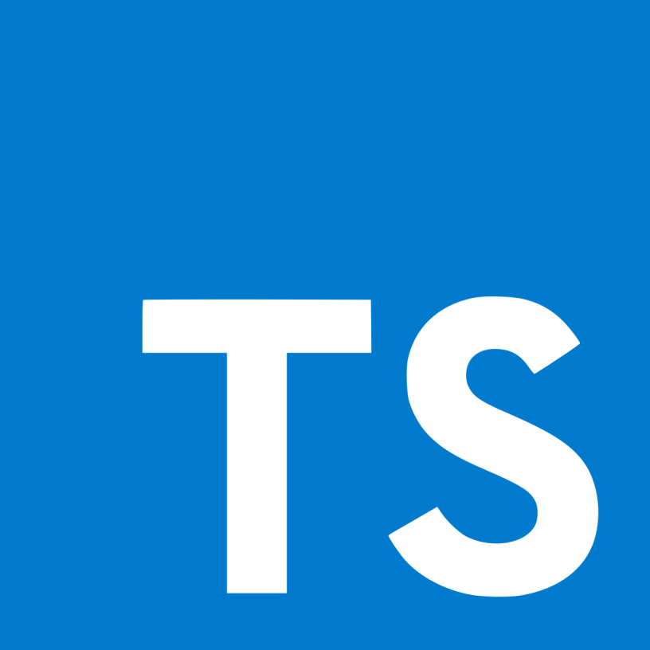

<div style="display:flex; align-items: center">
  <h1 style="position:relative; top: -6px" >Picture Of The Day Nasa</h1>
</div>

---

Picture Of The Day Nasa is app where users can see daily pictures from the Nasa and add them to favorite pictures to favorites section in order to save them.

#

### Table of Contents

- [Prerequisites](#prerequisites)
- [Tech Stack](#tech-stack)
- [Getting Started](#getting-started)
- [Development](#development)
- [Project Structure](#project-structure)
- [Deployment](#deployment)

#

### Prerequisites

-  _Node JS @14.X and up_
-  _npm @6 and up_
-  *TypeScript@4.9.3.X and up*

#

### Tech Stack

-  [Vue @3.2.47](https://vuejs.org/) - front-end framework.
-  [axios @1.2.2](https://axios-http.com/) - Promise based HTTP client for the browser and node.js.
-  [Tailwind @3.2.4](https://tailwindcss.com/) - Tailwind CSS is an open source CSS framework.

#

### Getting Started

1\. First of all you need to clone Movie Epic Quotes repository from github:

```sh
git clone https://github.com/GiorgiTsukhishvili/Picture-of-the-Day-From-Nasa-Vue.git
```

2\. Next step requires install all the dependencies.

```sh
npm ci
```

or

```sh
yarn
```

#

### Project Structure

```bash
├─── readme   # readme assets
├─── public      # public folder
├─── src    # src folder
│   ├─── assets
│   ├─── components
│   ├─── router
│   ├─── store
│   ├─── types
│   ├─── 404.tsx
│   ├─── main.ts
│   ├─── App.vue
- .eslintrc.cjs
- .prettierrc.js
- package.json
- tsconfig.json
- tailwind.config.cjs
- vite.config.ts
- .gitignore
- README.md
- postcss.config.cjs

```

#

### Deployment

In order to deploy project on the server you must build existing Movie Epic Quotes from terminal:

```sh
npm run build
```
